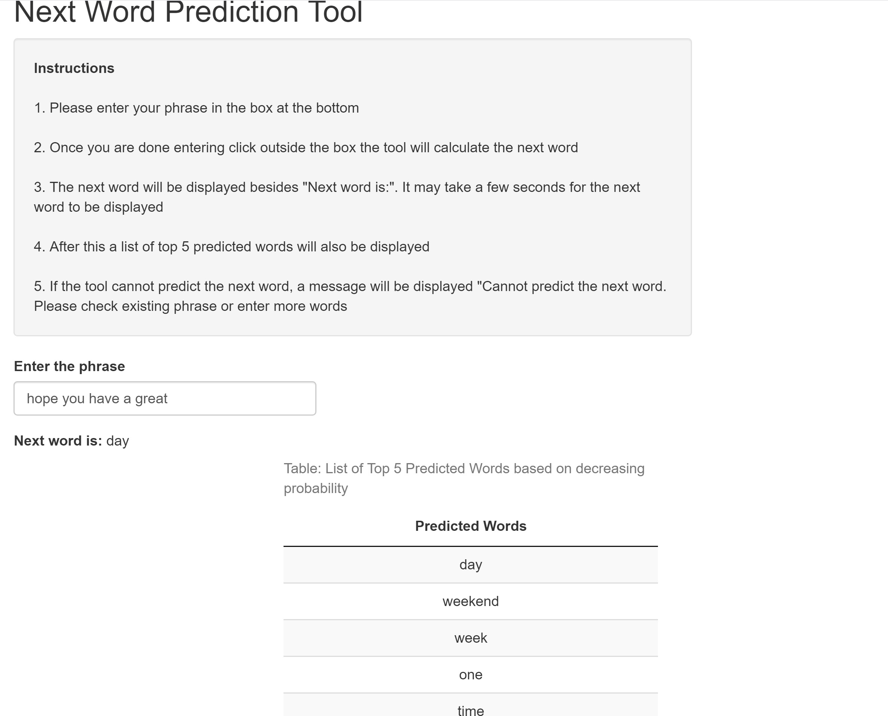

```{r setup, include=FALSE}
knitr::opts_chunk$set(echo = FALSE)
```

## Word Prediction Tool Overview

A word prediction tool has been developed that takes a phrase as an input and outputs the next word. The tool has been developed keeping in mind execution efficiency and accuracy.

The presentation contains the following:  

1. Description of the prediction algorithm  

2. Description of the Shiny App and how to use it  

3. Links to shiny app, its source code and this presentation  

## The Prediction Algorithm
The core of the prediction model is based on the stupid back-off algorithm (https://www.aclweb.org/anthology/D07-1090.pdf). The key steps of the prediction model are:  

1. Take a sample of the data set downloaded from the swiftkey dataset (5% of data)  

2. Clean-up the sample data and create n-grams (up to pentagram)  

3. Take the last n words of the input phrase and look up the next word in the respective n-gram  

4. Fill up the next word list with the predicted word and its probability (based on alpha value of 0.4)  

5. The next predicted word is the word in the list with the highest probability.

## The Prediction Tool (Shiny App)
The Prediction tool provides instructions at the top followed by input box to enter phrase in the Next Predicted Word tab. Once phrase is entered the next word is displayed. A table of the top 5 predicted words is also displayed in the Top 5 Predicted Words tab. A screen shot of the app is show below:  

<center>
{width=80%}
</center>

## Resources

Data Source:  https://d396qusza40orc.cloudfront.net/dsscapstone/dataset/Coursera-SwiftKey.zip","Coursera-SwiftKey.zip

Algorithm Details (Stupid Backoff): https://www.aclweb.org/anthology/D07-1090.pdf

Application Source Code: https://github.com/life-lng-learner/data_science_capstone_word_prediction

Shiny App: 

Presentation: 